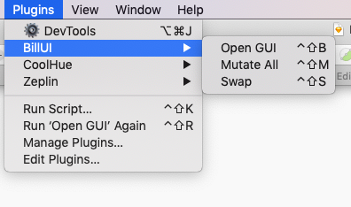
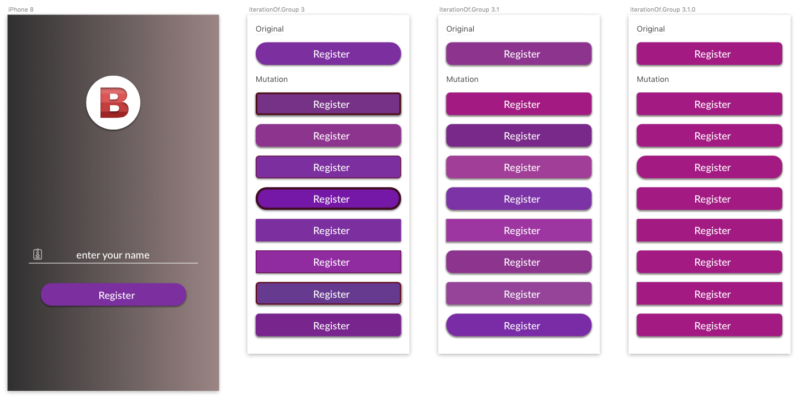
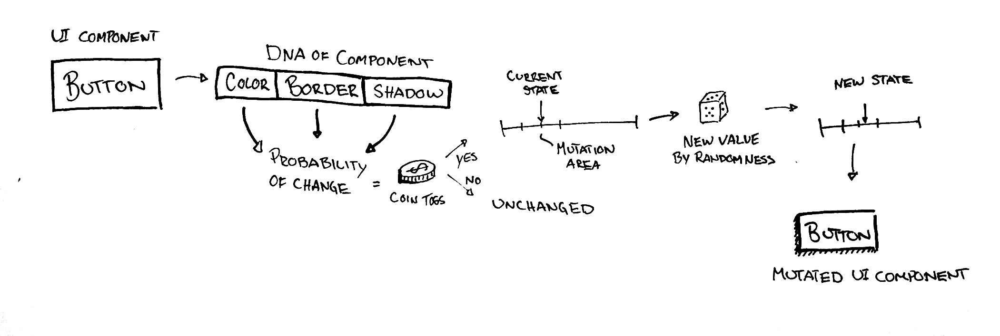

#  BillUI

Sketch plugin - Interactive artificial evolutionary tool in order to help you come up with design suggestions that are similar to your initial design.

## Installation
### Manual Install
1. Download [`billui.sketchplugin.zip`](https://github.com/SimonTakman/BillUI/releases/download/v1.0.0/billui.sketchplugin.zip)
2. Extract the archive
3. Install `billui.sketchplugin` for Sketch App

### Install with Sketchpacks
Click on the badge below:

## Usage
Access the plugin from Sketch's Menu Bar:

Open the GUI in order to select what parameters you want to mutate.

Below is an example of usage of the plugin:

## Algorithm
The algorithm is a _Genetic Algorithm_ and follows the recommendation from [`Mathworks`](https://mathworks.com/help/gads/how-the-genetic-algorithm-works.html). 

Below is a graphical representation of how the genetic algorithm works in our domain:

## Supported Shapes
* Rectangle
* Group w/ Rectangle & Text
* Symbol of Rectangle or Group w/ Rectangle & Text

## Contributors
* [`Carl Albertsson`](https://github.com/sCarlman)
* [`Simon Takman`](https://github.com/SimonTakman)
